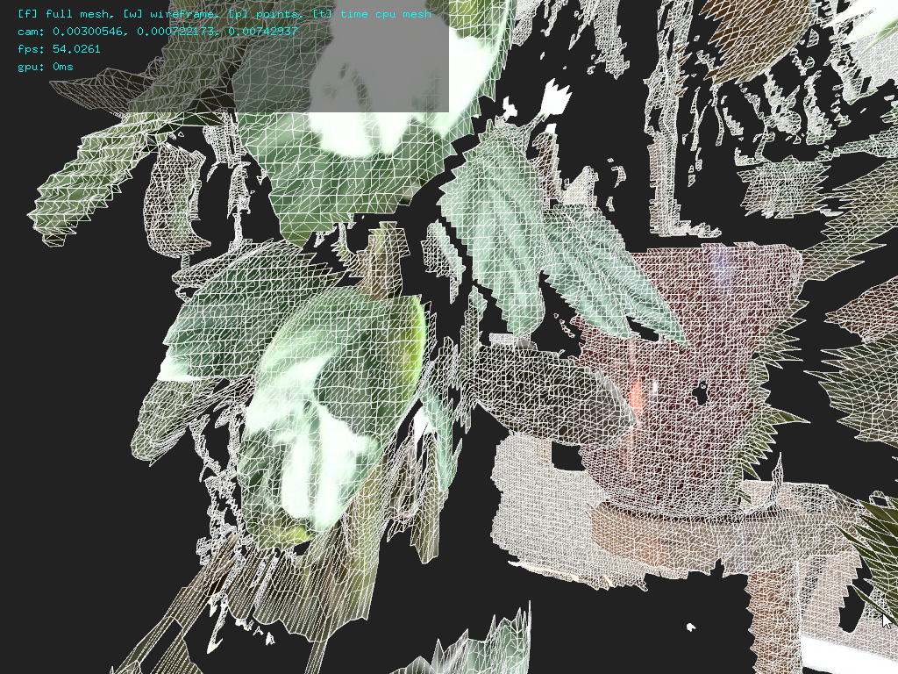

ofxKinectForWindows2 (exampleDepthMeshShader)
====================

The author of this example and the accompanying shaders are made by Lesley van Hoek\
https://github.com/lshoek

## Description

This example showcases how to build a mesh from the depth source using shaders. It is able to realize a full-resolution, textured and filtered depth mesh in a steady +/- 1ms on a GTX 1050. This is significantly faster than the `Depth::getDepthMesh()` call, which can quickly become a big bottleneck depending on your application. So this is great if you're looking to get around this!

## How does it work?

The vertices, indices and texture coordinates of the (VBO) mesh are generated on the GPU using compute shaders. First, a depth texture is acquired from the Kinect using the `ofxKinectForWindows2` API. This is then sent to a shader program that transforms each pixel to camera space and writes them to a vertex buffer. This is fast because this data resides on the GPU, so it does not have to be copied to/from the CPU. Another shader program filters the mesh by manipulating the mesh indices in the index buffer. The color frame texture coordinates are also queried from `ofxKinectForWindows2` and sent directly to the texture coordinate buffer of the mesh.

## Notes

If you have any questions or issues running this you're welcome to report them here or to me.

## License

MIT License
http://en.wikipedia.org/wiki/MIT_License
